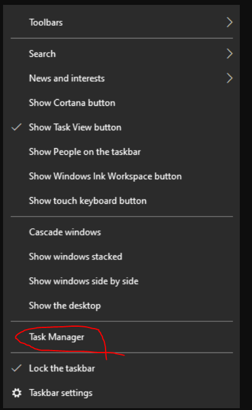
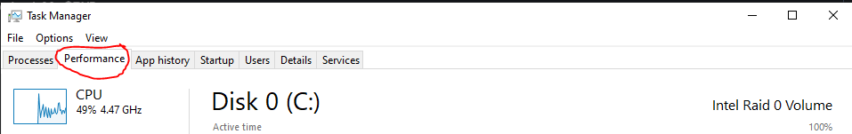
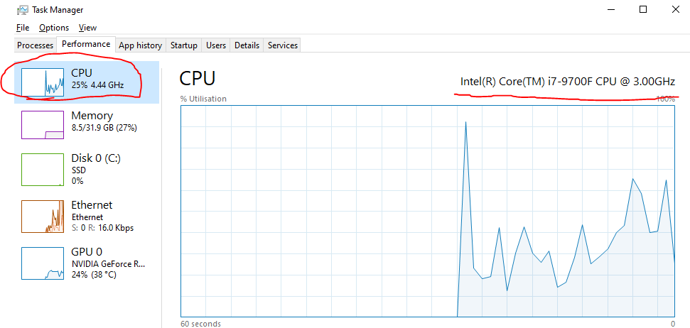
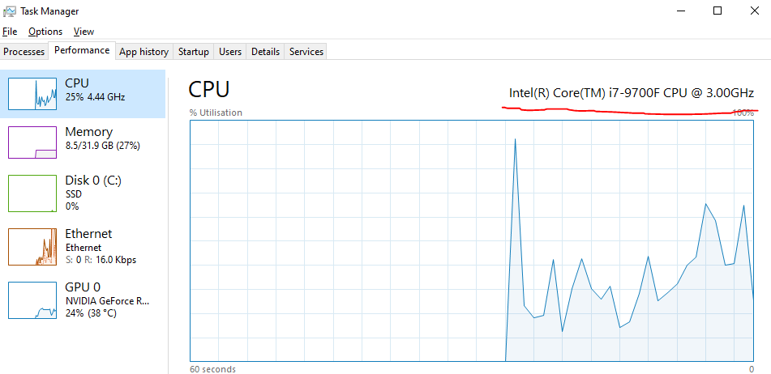
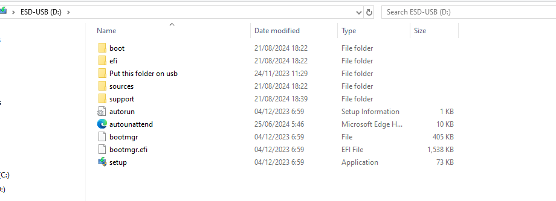
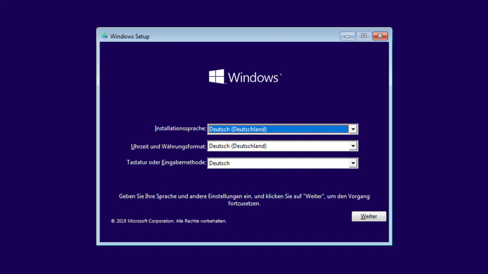
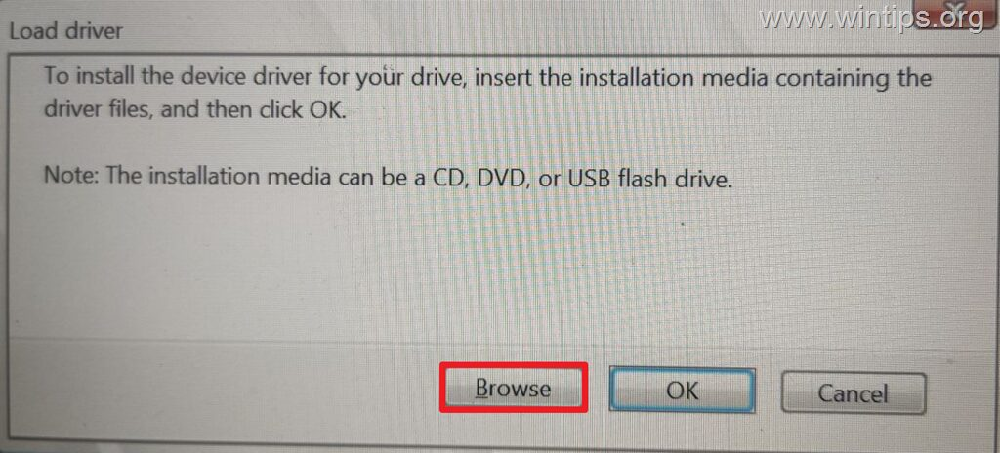
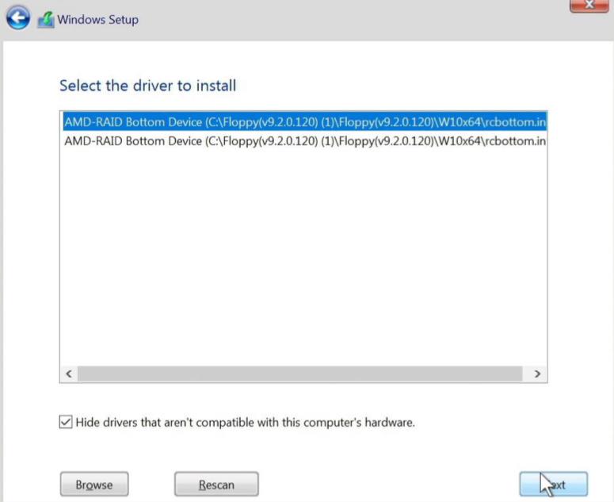
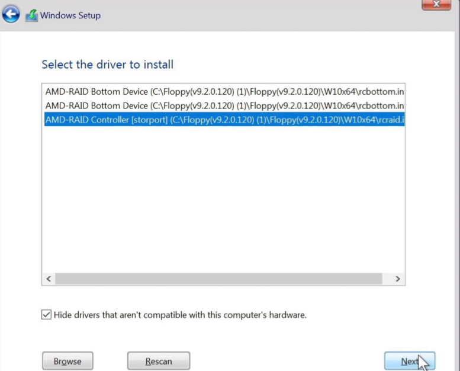
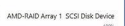

# AMD (RAIDABLE)

#### Determine Your Drivers & Download:

Check your CPU:

**Open Task Manager**

**Click on Performance**

**Click on "CPU"**

**Look on Top right, it will say your CPU**

AM5 Processors

* Ryzen 5 7500F
* Ryzen 5 PRO 7645
* Ryzen 5 7600
* Ryzen 5 7600X
* Ryzen 7 PRO 7745
* Ryzen 7 7700
* Ryzen 7 7700X
* Ryzen 7 7800X3D
* Ryzen 9 PRO 7945
* Ryzen 9 7900
* Ryzen 9 7900X
* Ryzen 9 7900X3D
* Ryzen 9 7950X
* Ryzen 9 7950X3D
* Any Ryzen CPU that looks like: Ryzen _ 7000+

If your CPU is not listed here, then it is an AM4 processor. Choose the file below that corresponds to your CPU.

#### Extract drivers to your USB Installation

Right click the drivers files you downloaded and extract them on to your installation medium (USB stick). Your USB should look EXACTLY like the reference image.

#### Enabling the RAID mode

1. Restart your computer and enter the BIOS again.
2. Locate following options and set them to following value:

**To Locate your SATA Mode:**

**Go to advanced mode in bios:**

Asus: Advanced -> SATA Configuration

Gigabyte: Settings/Advanced -> IO Ports

AsRock: Advanced -> Storage Configuration

MSI: Advanced -> Integrated Peripheral

Once found:

1. Set `SATA mode/controller` -> `[ RAID mode ]`
   * Change: AHCI -> RAID Mode
2. Set `NVMe mode` -> `[ Enabled ]`
   * If you don't have NVMe, ignore and make sure SATA mode is set.

**Go to Boot tab:**

1. Set `CSM` -> `[ Disabled ]`
   * If you can't find CSM ensure UEFI is enabled.
2. Save & exit the BIOS, then return back to BIOS again!

#### Clearing disks

Back in BIOS locate following option: `Advanced` -> `RAIDXpert2 Configuration Utility`. (On Gigabyte: Settings -> IO Ports -> `RAIDXpert2 Configuration Utility`.)

In the RAIDXpert2 menu do the following:

1. Enter `Manage Arrays / Array Management`.
2. Select `Delete Arrays` (if not grayed out).
   * Select every single disk you have!
   * Confirm to delete (this will delete all data on the disks).
3. If successful it will say: No more disks to delete!

#### Creating array(s)

In RAIDXpert2 navigate to `Manage Arrays / Array Management` -> `Create Array`.

1. Select Raid Level `Raidable`
2. Select `Select Physical Disks`
   * Select your disk; choose `Enable`
   * Select `Apply Changes`

Press `Create array` to create the array.

If you have multiple disks; create an array for each individual disk.

#### Installing windows



**Installation for AM4 Processors:**

* Save & exit the BIOS and ensure the USB you set up is plugged into your pc.
* You should see the Windows setup like the image below!

* Change the language settings if needed.
* Press `next` in the setup.
* If the setup asks for product key, select `I don't have a product key`
* Select the operating system: `Windows 10 Pro`
* Accept the TOS and `press next`.
* Now at setup step `Where do you want to install Windows?` you select `Load driver`.
  * You will get a pop-up; select browse

  * Navigate to the USB stick.
  * Select the `NVMe_RAID or SATA_RAID` -> Press `Ok`.
  * Choose the first option; "AMD-RAID Bottom Device" Driver, then select `next`.

* Select `Load driver` again.
  * Navigate to the USB stick.
  * Select the `NVMe_RAID or SATA_RAID` -> Press `Ok`.
  * Choose the third option; "AMD-RAID Controller" Driver, then select `next`.

* Select the disk you want to install Windows on and press next.
* Continue to install windows; then you're done!



**Installation for AM5 Processors:**

* Save & exit the BIOS and ensure the USB you set up is plugged into your pc.
* You should see the Windows setup like the image below!

* Change the language settings if needed.
* Press `next` in the setup.
* If the setup asks for product key, select `I don't have a product key`
* Select the operating system: `Windows 10 Pro`
* Accept the TOS and `press next`.
* Now at setup step `Where do you want to install Windows?` you select `Load driver`.
  * You will get a pop-up; select browse

  * Navigate to the USB stick.
  * Select the `NVMe_RAID or SATA_RAID` -> Press `Ok`.
  * Choose the first option; "AMD-RAID Bottom Device" Driver, then select `next`.

* Select `Load driver` again.
  * Navigate to the USB stick.
  * Select the `NVMe_RAID or SATA_RAID` -> Press `Ok`.
  * Choose the third option; "AMD-RAID Controller" Driver, then select `next`.

* Select the disk you want to install Windows on and press next.
* Continue to install windows; then you're done!



#### How to check if my Raid worked after reinstalling windows?

1. **Open Task manager**
2. **Click Performance**
3. **Click on "Disk 0 (C:)"**
4. **Should say on top right "AMD-RAID"**

