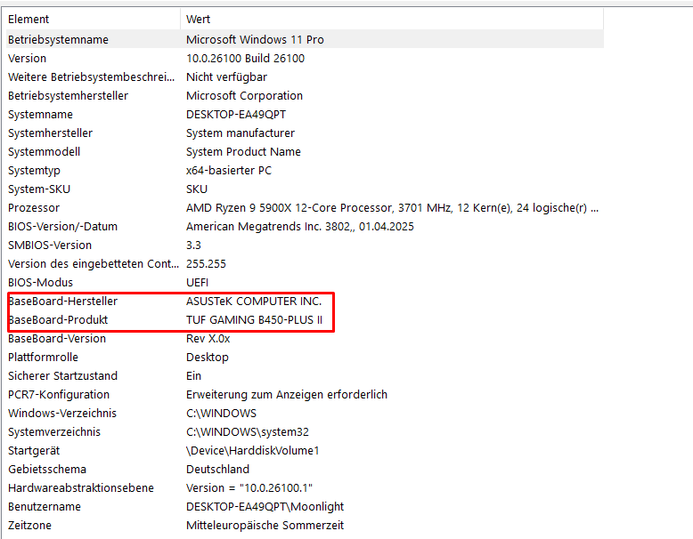

# Step 5: Verify MSINFO32

#### Check Your Motherboard Info

1. Press **Win + R**, type `msinfo32`, and hit **Enter**.
2. Under **System Summary**, look for:
   * **BaseBoard Manufacturer**
   * **BaseBoard Product**
   * **BaseBoard Version**
3. Cross-check this info with your **BIOS > EZ Mode** details.
   To enter BIOS easily, open **CMD as Administrator** and run:

   ```
   shutdown /r /fw /t 0
   ```



**Important**

* If **any value** in `msinfo32` or BIOS does **not match your original hardware**, **open a ticket**.
* If you've **ever used other spoofing tools** before ours, **open a ticket** discord.gg/DRr7VmPRkh as well.
