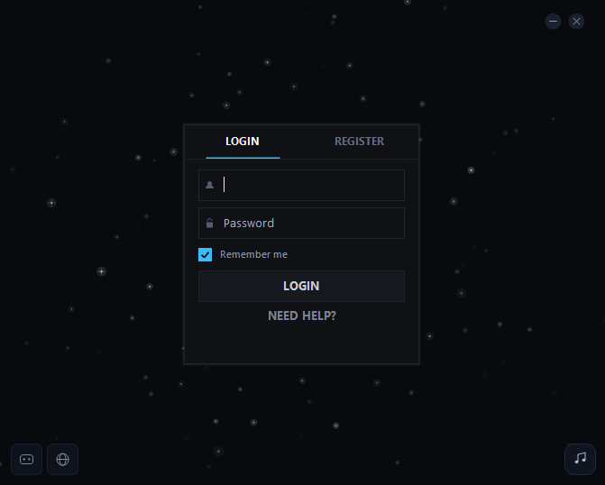
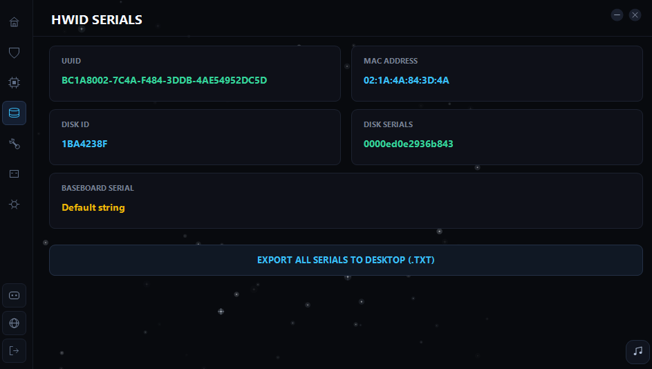
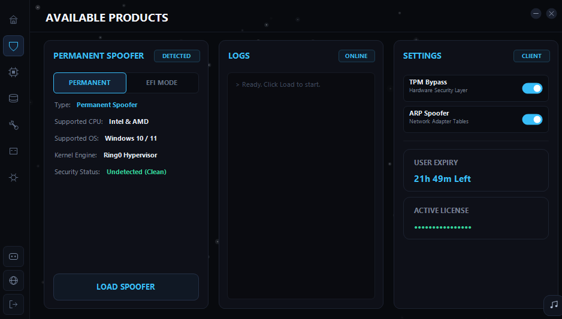

# Step 7: Spoofer

### Open LaSquale Loader

After saving your serials to the desktop, run the **Compatibility Checker** to determine which spoofing option you should use.


[PERMANENT](step-7-spoofer/permanent.md)



[ASUS EFI](step-7-spoofer/asus-efi.md)

