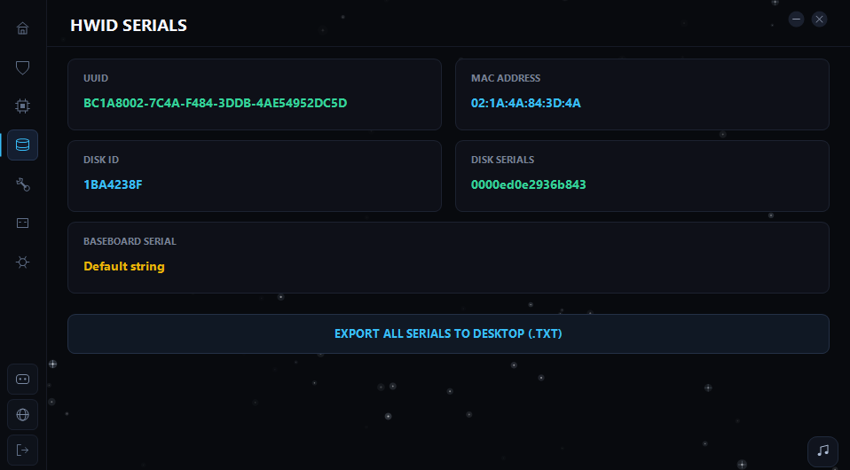
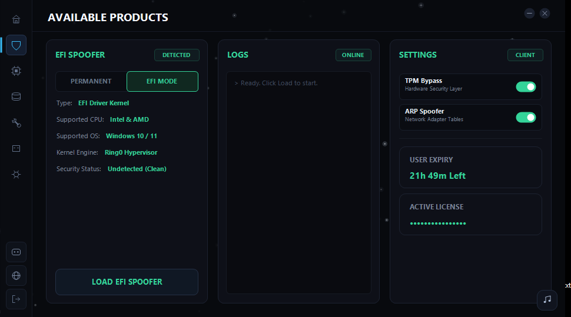
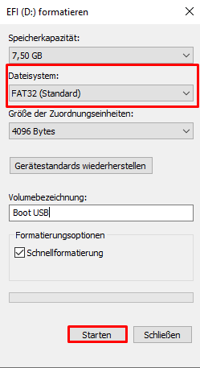
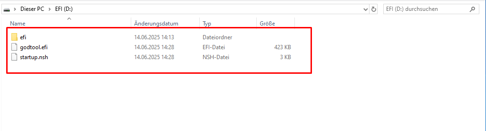

# ASUS EFI

### Follow these Steps





As soon as `EFI Spoof completed` appears, close the spoofer.
You should see a file named `EFIBOOT` on your desktop.

Replug your USB drive.
Right-click the USB drive, format it to `FAT32`, and rename it as you like.
Copy everything that is inside the `EFIBOOT` file onto the USB drive.





Now restart your PC and enter BIOS.
To enter BIOS easily, open **CMD as Administrator** and run:

```
shutdown /r /fw /t 0
```

1. In BIOS, navigate to **Advanced Mode > Boot > Boot Option #1** and select your USB drive as the first boot device, and **Windows Boot Manager** as **Boot Option #2**
2. Also, go to **Secure Boot**, make sure it is set to `Other OS`, then navigate to **Key Management** and `clear all keys`.
3. Now start your PC. If you see a series of commands spamming on the screen, you've done everything correctly.


**Important:** Always boot from the USB drive, or the spoofing will not work!

