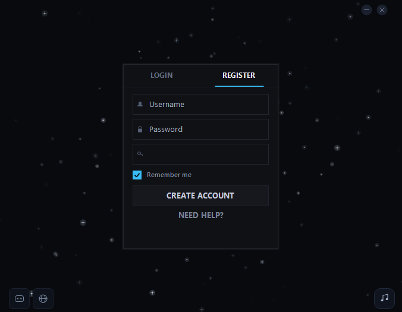
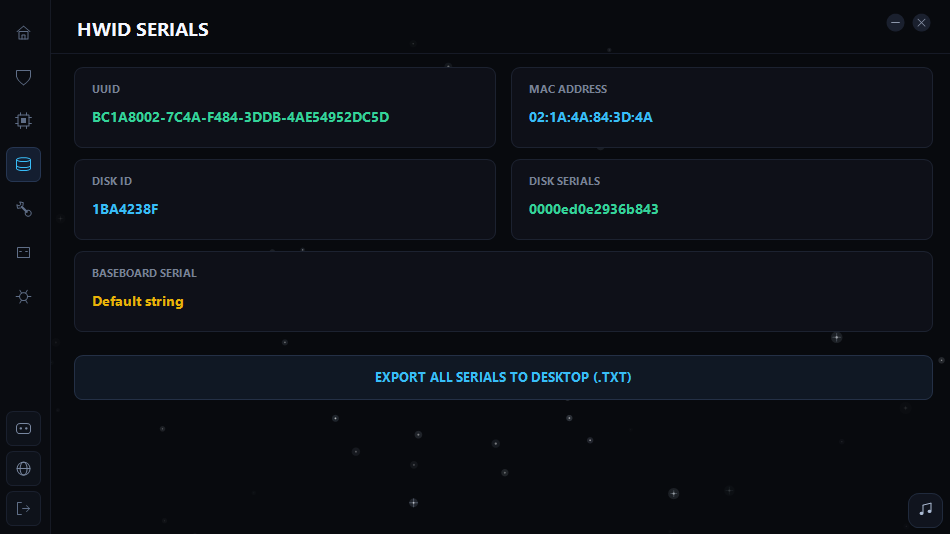

# Step 8: Verify Serials

After spoofing and restarting your PC, open the spoofer again and go to the **Checker** tab.

Open the **Serials.txt** file and compare the **serials** to verify the changes.


After verifying your serials and confirming the changes, continue with the process.
If **Motherboard**, **UUID**, or **MAC** addresses did not change, open a ticket for support.
*Note:* If the **Disk** serial didn't change, open ticket in discord.gg/DRr7VmPRkh
We will manually change it.

